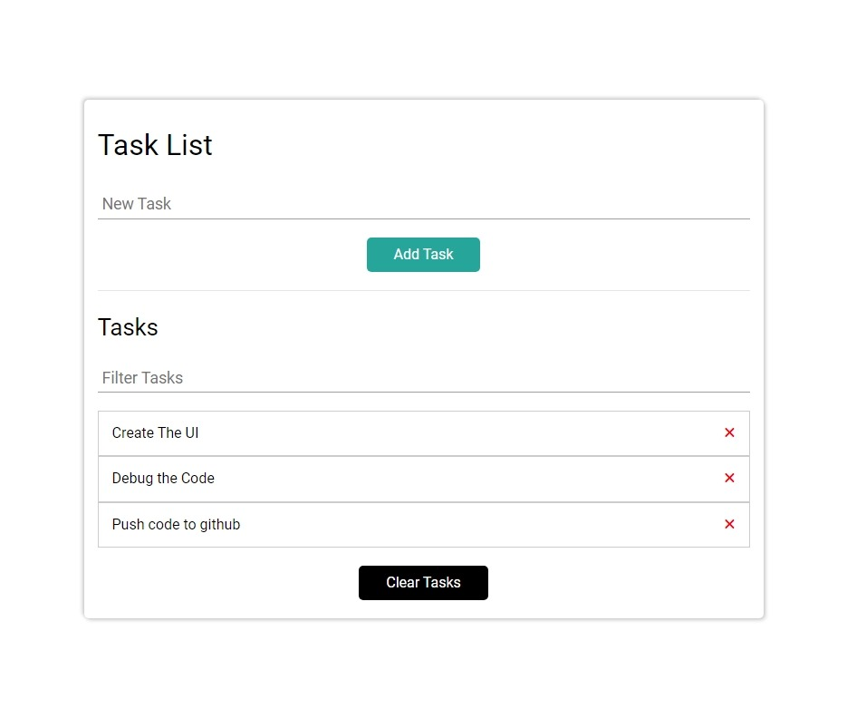

# Todo-List

Todo List with lot of features like add, remove , filter tasks, or even clear the whole list.

## Table of contents

- [Overview](#overview)
  - [The Todo-List features](#the-Todo-List-features)
  - [Screenshot](#screenshot)
  - [Links](#links)
- [My process](#my-process)
  - [Built with](#built-with)
  - [What I learned](#what-i-learned)
- [Author](#author)

## Overview

### The Todo-List features

Users should be able to:

- Add New Task to the list and see an alert if you want to add to the list without writing a task.
- Filter the list to reach a specific task with an insensitive search.
- Remove a task from the list or even clear the whole list
- All tasks are added to The local storage to keep them there even if the page reloaded.

### Screenshot

- Desktop view



### Links

- Live Site URL: [Todo-List](https://mahmoudsmohammed.github.io/Todo-List/)

## My process

### Built with

- HTML5
- CSS3
- SASS
- JavaScript

### What I learned

- How structure the project files.
- Using Git and Github.
- Use SASS and learn how to structure my files to be easy to debug.
- SASS Placeholder, Variables, and Mixins which save a lot of time.
- Make event delegation to create a task on a specific child element.
- Dealing With local storage to store data and keep it up to date with any change.

```Js
function store(task) {
  let tasks;
  if (localStorage.tasks === undefined) {
    tasks = [];
    tasks.push(task);
    localStorage.tasks = JSON.stringify(tasks);
  } else {
    tasks = JSON.parse(localStorage.tasks);
    tasks.push(task);
    localStorage.tasks = JSON.stringify(tasks);
  }
}
```

## Author

- Linkedin - [Mahmoud Sayed](https://www.linkedin.com/in/mahmoud-sayed-b85536217/)
- Codewars - [@MahmoudsMohammed](https://www.codewars.com/users/MahmoudsMohammed)
